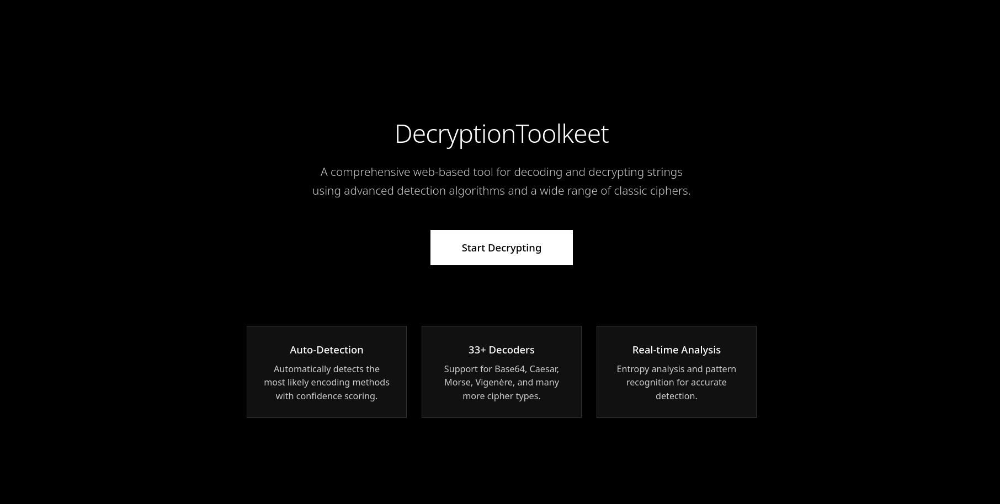

<h1 align="center"> Decryption Toolkeet</h1>

<p align="center">
  Decryption Toolkeet is a comprehensive Python CLI tool for automatically decoding and decrypting strings using a wide range of classic ciphers and encodings.
</p>

<p align="center">
  <a href="https://pepy.tech/projects/decryptiontoolkeet">
    
  </a>
  <a href="https://pypi.org/project/DecryptionToolkeet/">
    
  </a>
  <a href="https://pypi.org/project/DecryptionToolkeet/">
    
  </a>
  <a href="https://pypi.org/project/DecryptionToolkeet/">
    
  </a>
  <a href="https://github.com/Aarav2709/DecryptionToolkeet/blob/main/LICENSE">
    
  </a>
</p>

<p align="center">
  
</p>

---

##  Installation

### Option 1: Install from PyPI (Recommended)
Install the latest stable version from PyPI:
```bash
pip install DecryptionToolkeet
```

### Option 2: Clone Repository
Clone and run the tool locally:
```bash
git clone https://github.com/Aarav2709/DecryptionToolkeet.git
cd DecryptionToolkeet
cd DecryptionToolkeet
python main.py --help
```

### Option 3: Direct Usage
Run directly after downloading:
```bash
cd DecryptionToolkeet/DecryptionToolkeet
python main.py 'SGVsbG8gV29ybGQ='
```

---

##  How to Use

### Basic Commands

#### If installed via PyPI:
```bash
python -c "from DecryptionToolkeet import main; main()" 'SGVsbG8gV29ybGQ='
```

#### If running locally (in DecryptionToolkeet directory):

#### Auto-Detection Mode (Default)
```bash
python main.py 'SGVsbG8gV29ybGQ='
```
Automatically detects and decodes the input string.

#### Interactive Input Mode
```bash
python main.py -i
```
Prompts you to enter text interactively.

#### Force Specific Decoder
```bash
python main.py -f base64 'SGVsbG8gV29ybGQ='
python main.py -f caesar 'KHOOR ZRUOG'
python main.py -f morse '.... . .-.. .-.. ---'
```
Forces the tool to use a specific decoder type.

#### List All Available Decoders
```bash
python main.py -l
```
Shows all 33+ available decoders with descriptions.

#### Verbose Analysis Mode
```bash
python main.py -v '48656c6c6f20576f726c64'
```
Shows detailed analysis and all decode attempts.

#### String Analysis Only
```bash
python main.py --analyze 'mysterious_string'
```
Analyzes the string without attempting decoding.

#### Quiet Mode
```bash
python main.py -q 'SGVsbG8gV29ybGQ='
```
Shows minimal output (results only).

#### Confidence Threshold
```bash
python main.py --threshold 0.8 'SGVsbG8gV29ybGQ='
```
Sets confidence threshold for auto-detection (0.0-1.0).

#### Disable Colors
```bash
python main.py --no-color 'SGVsbG8gV29ybGQ='
```
Disables colored output for terminals that don't support it.

---

##  Features

###  Core Features
-  Auto-Detection with intelligent confidence scoring
-  Colorized output with progress bars and icons
-  Entropy analysis and complexity assessment
-  Multiple operation modes (auto, force, interactive)
-  High performance with no external dependencies
-  Extensible architecture for adding new decoders

### 🔍 Supported Decoders (33+ Total)
- **Base Encodings**: Base64, Base32, Base85, UUencode, XXencode
- **Text Encodings**: Hex, Binary, ASCII, URL, HTML, Unicode
- **Substitution Ciphers**: Caesar, ROT13, Atbash, Affine
- **Polyalphabetic Ciphers**: Vigenère, Beaufort, Gromark
- **Polygraphic Ciphers**: Playfair, Four-square, Two-square
- **Transposition Ciphers**: Rail Fence, Columnar
- **Grid/Coordinate Ciphers**: Polybius, Phillips, Bifid, Trifid
- **Advanced Ciphers**: Nihilist, XOR (brute force)
- **Special Formats**: Morse code, Baconian, Timestamp conversion

---

##  Sample Test Strings
Try these encoded strings with the tool:

#### For PyPI installation:
```bash
python -c "from DecryptionToolkeet import main; main(['SGVsbG8gV29ybGQ='])"
python -c "from DecryptionToolkeet import main; main(['48656c6c6f20576f726c64'])"
python -c "from DecryptionToolkeet import main; main(['KHOOR ZRUOG'])"
```

#### For local installation:
```bash
python main.py 'SGVsbG8gV29ybGQ='
python main.py '48656c6c6f20576f726c64'
python main.py 'KHOOR ZRUOG'
python main.py '.... . .-.. .-.. ---   .-- --- .-. .-.. -..'
python main.py '01001000 01100101 01101100 01101100 01101111'
python main.py 'Uryyb Jbeyq'
python main.py 'Hello%20World'
python main.py 'SVOOL DLIOW'
```

---

##  How the Tool Works
- Input any encoded or encrypted string
- The tool analyzes entropy, character distribution, and patterns
- Confidence scores determine the most likely encoding types
- Multiple decoders attempt to process the input
- Results are displayed with success indicators and formatting

---

## 💡 Tips
- Use verbose mode (-v) to see all attempted decoders and their confidence scores
- The tool works best with properly formatted input strings
- For interactive mode, you can test multiple strings without restarting
- Force mode (-f) is useful when you know the specific encoding type
